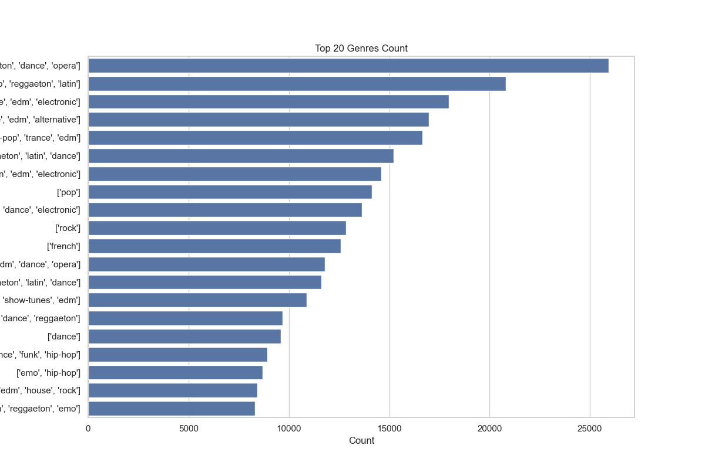
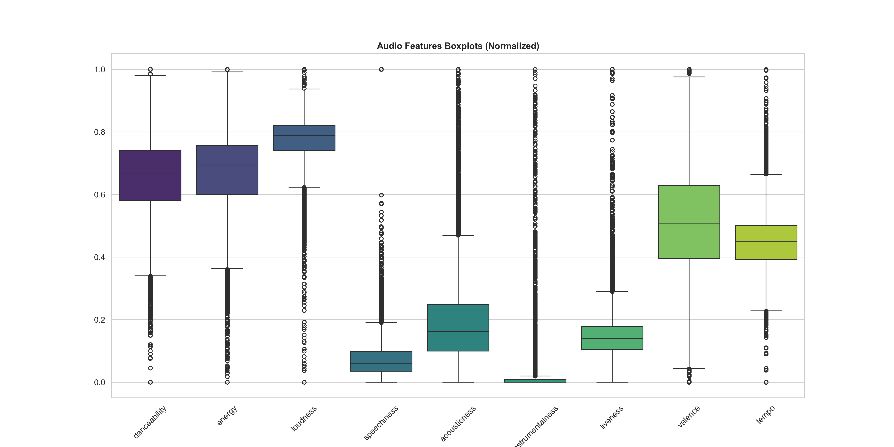

# 🌦️ WeatherChart: Music Genre Prediction
> Predicting musical preferences using Climate, Geography, and Socioeconomic Big Data.

This project analyzes the relationship between our environment (temperature, location) and our musical tastes. By integrating **Spotify Charts** (~18M rows) with **Global Temperature** records and **World Bank** economic data, we build a robust dataset for machine learning.

## 📊 Project Highlights
- **18.4 Million Rows**: High-volume training dataset.
- **68 Countries**: Global geographic coverage.
- **24 Features**: Including acoustic metrics, monthly average temperatures, GDP, and education levels.
- **Zero Nulls**: 100% clean data in the final training set.

---

## 🛠️ The Data Pipeline
The project follows a modular 13-step automated pipeline:

### Phase 1: Data Ingestion & Cleaning
1.  **[1-filter_charts.py](scripts/1-filter_charts.py)**: Filters raw 3.5GB Spotify charts.
2.  **[2-process_genres.py](scripts/2-process_genres.py)**: Aggregates artist genres and audio features.
3.  **[3-join_datasets.py](scripts/3-join_datasets.py)**: **Smart Match** join (Exact -> Split Artist -> Primary).
4.  **[4-analyze_missing.py](scripts/4-analyze_missing.py)**: Quality control for unmapped artists.

### Phase 2: Feature Engineering (Integration)
5.  **[5-process_climate.py](scripts/5-process_climate.py)**: Monthly temperature averages since 1970.
6.  **[6-join_climate.py](scripts/6-join_climate.py)**: Spatio-temporal join (Country + Month).
7.  **[7-process_countries.py](scripts/7-process_countries.py)**: Filters global socioeconomic data.
8.  **[8-join_economy.py](scripts/8-join_economy.py)**: Adds Population and GDP features.
9.  **[9-process_latitude.py](scripts/9-process_latitude.py)**: Extracts Geospatial data (with Hemisphere sign fixes).
10. **[10-join_latitude.py](scripts/10-join_latitude.py)**: Final feature enrichment.

### Phase 3: Dataset Creation & Analysis
11. **[11-create_training_set.py](scripts/11-create_training_set.py)**: Generates the 6GB `train_dataset.csv`.
12. **[12-eda.py](scripts/12-eda.py)**: Generates high-quality statistical visualizations.
13. **[13-preprocess.py](scripts/13-preprocess.py)**: Feature scaling (StandardScaler), Encoding, and Training/Test splits.

---

## 🖼️ Visual Gallery (EDA)
Below are some key insights generated during the analysis phase:

````carousel

<!-- slide -->

<!-- slide -->

<!-- slide -->

````

---

## 💾 Database Management (MySQL)
The final `train_dataset.csv` (6.2 GB) is optimized for high-performance SQL analytics. 

**Recommended Import Path:**
1. Move the file to your MySQL `secure_file_priv` directory (e.g., `C:/ProgramData/MySQL/MySQL Server 8.0/Uploads/`).
2. Run the specialized loading command:
```sql
LOAD DATA INFILE 'C:/ProgramData/MySQL/MySQL Server 8.0/Uploads/train_dataset.csv'
INTO TABLE weatherchart.train_dataset
FIELDS TERMINATED BY ',' 
OPTIONALLY ENCLOSED BY '"'
LINES TERMINATED BY '\r\n'
IGNORE 1 LINES;
```

---

## 📂 Project Structure
```
WeatherChart/
├── data/               # Raw and Processed datasets (CSV, Parquet)
├── plots/              # Professional EDA visualizations
├── scripts/            # Python Pipeline (01 to 13)
├── requirements.txt    # Environment dependencies
└── README.md           # This document
```

## 🚀 Getting Started
1. Install dependencies: `pip install -r requirements.txt`
2. Run the pipeline sequentially or import the training set into MySQL for analysis.
3. Explore the preprocessed files in `data/*.parquet` for model training.

---
*Developed for: Clase Fundamentos Aprendizaje Automatico.*
