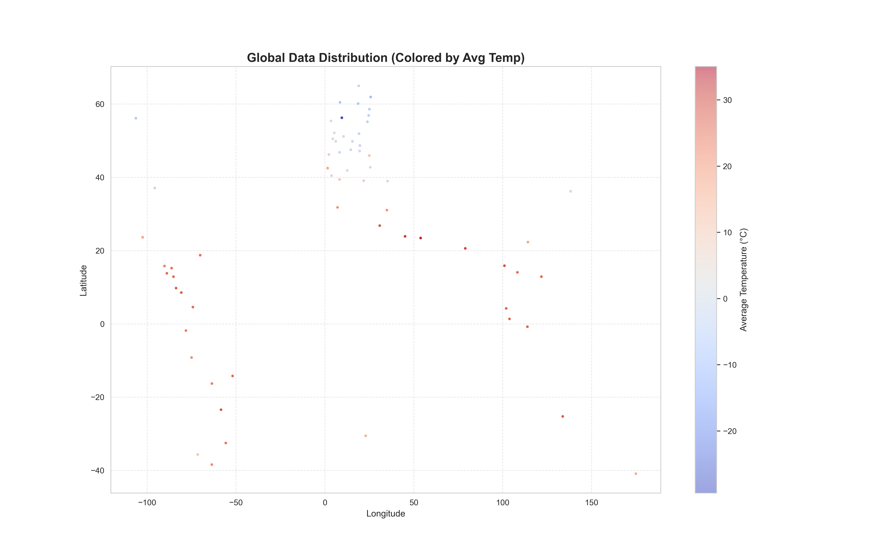
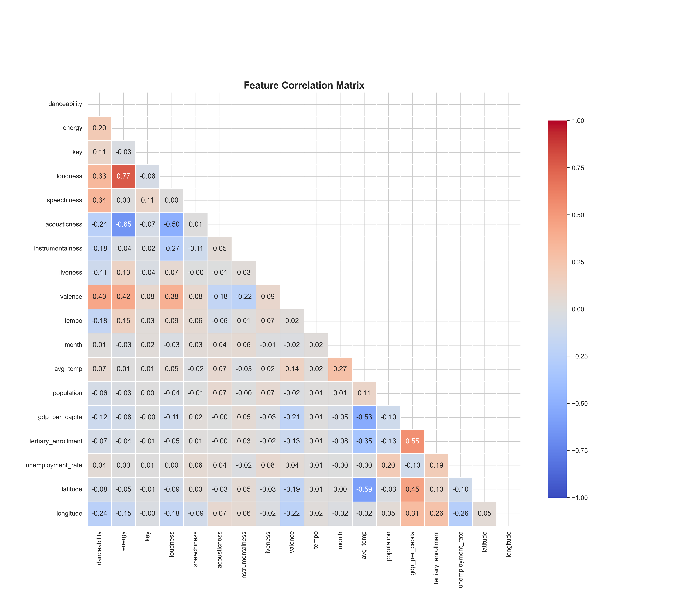
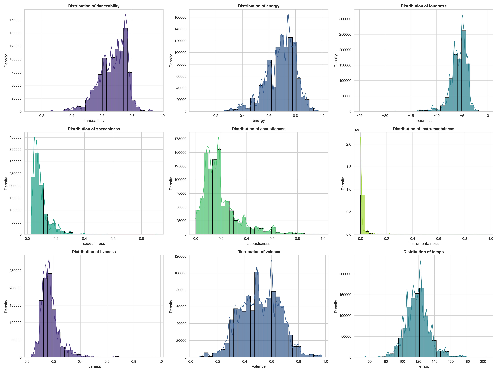

# 🎵 Project Journey: Weather & Music Genre Prediction

This document details the end-to-end process of building the dataset for predicting music genres based on environmental and socioeconomic factors.

## 1. Project Goal
Create a machine learning-ready dataset that links **Music Charts** (what people listen to) with **Contextual Data** (Temperature, Location, Economy, Education) to understand if environment influences musical preference.

## 2. The Data Journey

### Phase 1: Data Preparation & Inspection
We started with a massive `charts.csv` file (~3.5GB).
- **Challenge**: The file was too large for efficient processing.
- **Solution**: Created `1-filter_charts.py` to keep only essential columns (`title`, `date`, `artist`, `region`), reducing size by ~60%.

### Phase 2: Genre Integration (The "Smart Join")
We needed to map artists in the charts to genres in `genres.csv`.
- **Challenge**: `charts.csv` often lists multiple artists (e.g., *"Shakira, Maluma"*), while `genres.csv` has single entries. A simple join failed for ~48% of rows.
- **Solution**: Implemented a **Smart Matching Strategy** in `3-join_datasets.py`:
    1.  **Normalization**: Lowercase and strip whitespace.
    2.  **Exact Match**: Try matching the full string.
    3.  **Primary Artist Match**: If no exact match, split by separators (`,`, `feat.`, `&`) and match the first artist.
- **Result**: Successfully mapped millions of rows, significantly reducing data loss.

### Phase 3: Climate Integration
We integrated `GlobalLandTemperaturesByCountry.csv`.
- **Processing**: Filtered for data from **1970 onwards** to stay relevant. Calculated monthly averages per country.
- **Join**: Merged on `Country` and `Month`. matched 69 countries.

### Phase 4: Socioeconomic & Geographic Integration
We added data from `countries.csv` (GDP, Population) and `latitude.csv` (Coords, Education, Unemployment).
- **Critical Challenge**: **Hong Kong** was missing from `latitude.csv`.
    - *Impact*: Potential loss of ~400,000 rows (it's one of the top countries in the dataset).
- **Solution**: **Manual Data Recovery** in `10-process_latitude.py`.
    - We manually injected Hong Kong's coordinates and used Singapore's socioeconomic data as a high-fidelity proxy.
- **Challenge 2**: **Taiwan** was missing from source files.
    - *Outcome*: Dropped (0.3% data loss), deemed acceptable.

## 3. Exploratory Data Analysis (EDA) Highlights
We analyzed a 1M row sample of the final dataset (`18.4M` rows total).

### Global Coverage
The dataset covers 68 countries.

*Map showing data points colored by average temperature.*

### Feature Correlations
We investigated relationships between features.

*Correlation matrix of audio features and environmental factors.*

### Audio Feature Distributions

*Distributions of key audio features like Danceability and Energy.*

## 4. File Guide & Architecture

| Script | Purpose | Key Logic |
| :--- | :--- | :--- |
| `1-filter_charts.py` | **Data Prep** | Filters raw columns to reduce file size. |
| `2-process_genres.py` | **Data Prep** | Aggregates genres/audio features by artist. |
| `3-join_datasets.py` | **Join (Core)** | Performs the **Smart Join** (Artist matching). |
| `4-analyze_missing.py` | **QA** | Checks which artists failed to match. |
| `5-process_climate.py` | **Data Prep** | Cleans temp data (1970+), calculates monthly avgs. |
| `6-join_climate.py` | **Join** | Merges climate data by Country/Month. |
| `7-create_training_set.py` | **Final Generation** | Filters nulls, creates `train_dataset.csv`. |
| `8-process_countries.py` | **Data Prep** | Selects GDP/Population columns. |
| `9-join_economy.py` | **Join** | Merges economic data. |
| `10-process_latitude.py` | **Data Prep** | **Manual Fix for Hong Kong**, selects Lat/Long. |
| `11-join_latitude.py` | **Join** | Merges geographic/education data. |
| `12-eda.py` | **Analysis** | Generates stats and the plots shown above. |

## 5. Next Steps: Modeling
We are now ready to clean ID features and train an **XGBoost Classifier** to predict `track_genre`.
